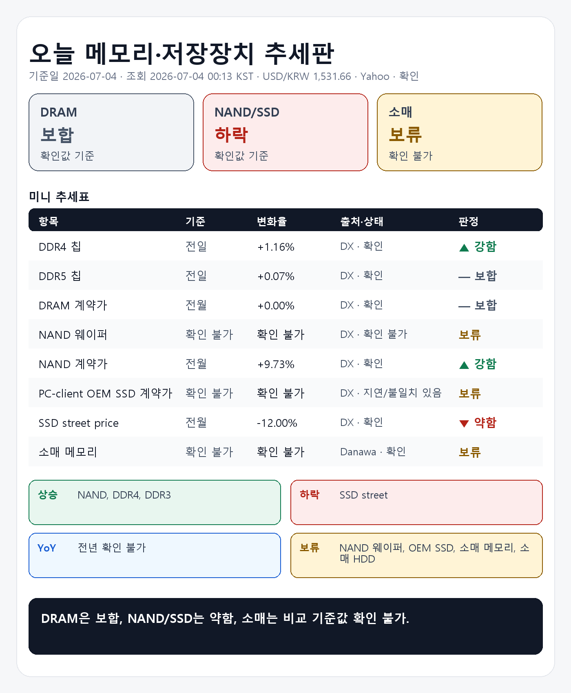

## 1. 기준 환율 1줄
USD/KRW: 1,531.66원 (조회 2026-07-04 00:13 KST, 출처 Yahoo Finance USDKRW=X, 원문 Last Update 2026-07-04 00:13 KST, 상태 확인, 전일 대비 -0.23%).

## 2. 오늘 한눈에 추세판
| 구분 | 현재값 | 전일 | 전주 | 전월 | 전년 | 추세 | 판정 |
|---|---:|---|---|---|---|---|---|
| DDR3 칩 | $12.476 (약 19,109원) | 공개 변화율 +1.09% | 확인 불가 | 확인 불가 | 확인 불가 | 공개 변화율 +1.09% 기준 상승 | 강함 |
| DDR4 칩 | $76.375 (약 116,981원) | 공개 변화율 +1.16% | 확인 불가 | 확인 불가 | 확인 불가 | 공개 변화율 +1.16% 기준 상승 | 강함 |
| DDR5 칩 | $46.667 (약 71,478원) | 공개 변화율 +0.07% | 확인 불가 | 확인 불가 | 확인 불가 | 공개 변화율 +0.07% 기준 보합 | 보합 |
| DDR4 모듈 | $149.576 (약 229,100원) | 확인 불가 | 공개 변화율 -0.23% | 확인 불가 | 확인 불가 | 공개 변화율 -0.23% 기준 보합 | 보합 |
| DDR5 모듈 | $208.500 (약 319,351원) | 확인 불가 | 공개 변화율 -0.24% | 확인 불가 | 확인 불가 | 공개 변화율 -0.24% 기준 보합 | 보합 |
| DRAM 계약가 (DDR4 8GB SO-DIMM) | $119.000 (약 182,268원) | 확인 불가 | 확인 불가 | 공개 변화율 +0.00%, 기준값 확인 불가 | 확인 불가 | 공개 변화율 +0.00% 기준 보합 | 보합 |
| NAND 웨이퍼 | 확인 불가 | 확인 불가 | 확인 불가 | 확인 불가 | 확인 불가 | 확인 불가 | 판단 보류 |
| NAND 계약가 (NAND 128Gb 16Gx8 Speedns) | $26.508 (약 40,601원) | 확인 불가 | 확인 불가 | 공개 변화율 +9.73%, 기준값 확인 불가 | 확인 불가 | 공개 변화율 +9.73% 기준 상승 | 강함 |
| PC-client OEM SSD 계약가 (1TB-mSATA/M.2 TLC PCIe-Value Grade) | 지연/불일치 있음 | 확인 불가 | 확인 불가 | 지연/불일치 있음 | 확인 불가 | 지연/불일치 있음 | 판단 보류 |
| SSD street price (990 Pro) | $219.990 (약 336,950원) | 확인 불가 | 확인 불가 | 공개 변화율 -12.00%, 기준값 확인 불가 | 확인 불가 | 공개 변화율 -12.00% 기준 하락 | 약함 |
| 소매 메모리 (삼성전자 DDR5-5600 32GB) | 650,000원 | 확인 불가 | 확인 불가 | 확인 불가 | 확인 불가 | 비교 기준값 확인 불가 | 판단 보류 |
| 소매 HDD (Seagate BarraCuda 8TB) | 472,280원 | 확인 불가 | 확인 불가 | 확인 불가 | 확인 불가 | 비교 기준값 확인 불가 | 판단 보류 |
| 소매 SSD (Samsung 990 PRO 1TB) | 399,990원 | 확인 불가 | 확인 불가 | 확인 불가 | 확인 불가 | 비교 기준값 확인 불가 | 판단 보류 |

## 3. 상승·하락 요약 4줄
상승: DDR3 칩 +1.09%, DDR4 칩 +1.16%, NAND 계약가 +9.73%
하락: SSD street price -12.00%
전년: 전년 기준값 확인 불가
보류: NAND 웨이퍼, PC-client OEM SSD 계약가, 소매 메모리, 소매 HDD, 소매 SSD

## 4. 가격표
| 항목 | 현재값 | 조회 시각·출처·상태 | 원문 Last Update | 전월 대비 | 전년 대비 | 추세 |
|---|---:|---|---|---|---|---|
| DDR3 칩 | $12.476 (약 19,109원) | 2026-07-04 00:13 KST · DRAMeXchange 공개표 (https://www.dramexchange.com/Price/Dram_Spot) · 상태 확인 | 홈 공개표, 원문 Last Update 별도 없음 | 확인 불가 | 확인 불가 | 공개 변화율 +1.09% 기준 상승 |
| DDR4 칩 | $76.375 (약 116,981원) | 2026-07-04 00:13 KST · DRAMeXchange 공개표 (https://www.dramexchange.com/Price/Dram_Spot) · 상태 확인 | 홈 공개표, 원문 Last Update 별도 없음 | 확인 불가 | 확인 불가 | 공개 변화율 +1.16% 기준 상승 |
| DDR5 칩 | $46.667 (약 71,478원) | 2026-07-04 00:13 KST · DRAMeXchange 공개표 (https://www.dramexchange.com/Price/Dram_Spot) · 상태 확인 | 홈 공개표, 원문 Last Update 별도 없음 | 확인 불가 | 확인 불가 | 공개 변화율 +0.07% 기준 보합 |
| DDR4 모듈 | $149.576 (약 229,100원) | 2026-07-04 00:13 KST · DRAMeXchange 공개표 (https://www.dramexchange.com/Price/Module_Spot) · 상태 확인 | 홈 공개표, 원문 Last Update 별도 없음 | 확인 불가 | 확인 불가 | 공개 변화율 -0.23% 기준 보합 |
| DDR5 모듈 | $208.500 (약 319,351원) | 2026-07-04 00:13 KST · DRAMeXchange 공개표 (https://www.dramexchange.com/Price/Module_Spot) · 상태 확인 | 홈 공개표, 원문 Last Update 별도 없음 | 확인 불가 | 확인 불가 | 공개 변화율 -0.24% 기준 보합 |
| DRAM 계약가 (DDR4 8GB SO-DIMM) | $119.000 (약 182,268원) | 2026-07-04 00:13 KST · DRAMeXchange HomePrice NationalDramContract (https://www.dramexchange.com/Price/NationalContractDramDetail) · 상태 확인 | 2026-05-29 15:00:00 | 공개 변화율 +0.00%, 기준값 확인 불가 | 확인 불가 | 공개 변화율 +0.00% 기준 보합 |
| NAND 웨이퍼 | 확인 불가 | 2026-07-04 00:13 KST · DRAMeXchange 공개표 (https://www.dramexchange.com/) · 상태 확인 불가 | 확인 불가 | 확인 불가 | 확인 불가 | 확인 불가 |
| NAND 계약가 (NAND 128Gb 16Gx8 Speedns) | $26.508 (약 40,601원) | 2026-07-04 00:13 KST · DRAMeXchange HomePrice NationalFlashContract (https://www.dramexchange.com/Price/NationalContractFlashDetail) · 상태 확인 | 2026-05-29 10:00:00 | 공개 변화율 +9.73%, 기준값 확인 불가 | 확인 불가 | 공개 변화율 +9.73% 기준 상승 |
| PC-client OEM SSD 계약가 (1TB-mSATA/M.2 TLC PCIe-Value Grade) | 지연/불일치 있음 | 2026-07-04 00:13 KST · DRAMeXchange HomePrice PCC (https://www.dramexchange.com/Price/PCClientOEMSSD) · 상태 지연/불일치 있음 | 2026-04-27 10:00:00 | 지연/불일치 있음 | 확인 불가 | 지연/불일치 있음 |
| SSD street price (990 Pro) | $219.990 (약 336,950원) | 2026-07-04 00:13 KST · DRAMeXchange HomePrice SSD (https://www.dramexchange.com/Price/SSD_Street) · 상태 확인 | 2026-06-26 13:00:00 | 공개 변화율 -12.00%, 기준값 확인 불가 | 확인 불가 | 공개 변화율 -12.00% 기준 하락 |
| 소매 메모리 (삼성전자 DDR5-5600 32GB) | 650,000원 | 2026-07-04 00:13 KST · Danawa prod 가격비교 · 삼성전자 DDR5-5600 32GB (https://prod.danawa.com/info/?pcode=20644043) · 상태 확인 | 상품 페이지 직접 조회, 원문 Last Update 별도 없음 | 확인 불가 | 확인 불가 | 비교 기준값 확인 불가 |
| 소매 HDD (Seagate BarraCuda 8TB) | 472,280원 | 2026-07-04 00:13 KST · Danawa prod 가격비교 · Seagate BarraCuda 8TB (https://prod.danawa.com/info/?pcode=5764992) · 상태 확인 | 상품 페이지 직접 조회, 원문 Last Update 별도 없음 | 확인 불가 | 확인 불가 | 비교 기준값 확인 불가 |
| 소매 SSD (Samsung 990 PRO 1TB) | 399,990원 | 2026-07-04 00:13 KST · Danawa prod 가격비교 · Samsung 990 PRO 1TB (https://prod.danawa.com/info/?pcode=18297002) · 상태 확인 | 상품 페이지 직접 조회, 원문 Last Update 별도 없음 | 확인 불가 | 확인 불가 | 비교 기준값 확인 불가 |

## 5. 마지막 한 줄
전월 기준으로 가장 강한 쪽은 NAND 계약가, 전년 기준으로 가장 구조적으로 강한 쪽은 확인 불가, 가장 약한 쪽은 SSD street price, DRAM은 보합, NAND는 약함.

## 6. 마지막 이미지형 요약판

