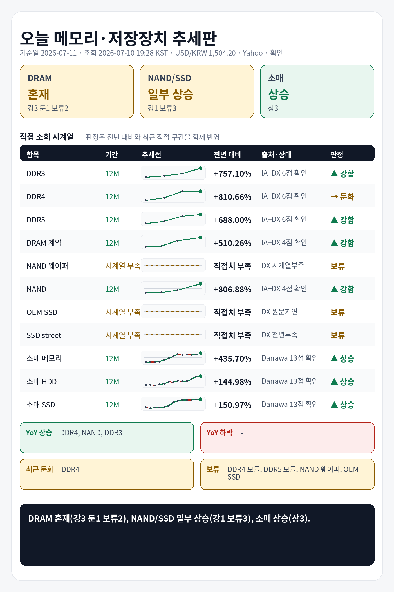

## 1. 기준 환율 1줄
USD/KRW: 1,504.20원 (조회 2026-07-10 19:28 KST, 출처 Yahoo Finance USDKRW=X, 원문 Last Update 2026-07-10 19:28 KST, 상태 확인, 전일 대비 -1.75%).

## 2. 오늘 한눈에 추세판
| 구분 | 현재값 | 전일 | 전주 | 전월 | 전년 | 추세 | 판정 |
|---|---:|---|---|---|---|---|---|
| DDR3 칩 | $12.925 (약 19,442원) | 공개 변화율 +0.39% | 확인 불가 | 확인 불가 | 전년 대비 +757.10% · 전년값 캡처 2025-07-11 17:06 KST, 항목 DDR3 4Gb 512Mx8 1600/1866 · 출처 Internet Archive DRAMeXchange 공개표 캡처 | 전년 상승, 최근 직접구간 +114.06% | 강함 |
| DDR4 칩 | $77.625 (약 116,764원) | 공개 변화율 +0.65% | 확인 불가 | 확인 불가 | 전년 대비 +810.66% · 전년값 캡처 2025-07-11 17:06 KST, 항목 DDR4 16Gb (2Gx8)3200 · 출처 Internet Archive DRAMeXchange 공개표 캡처 | 전년 상승, 최근 직접구간 +0.24% | 둔화 |
| DDR5 칩 | $47.800 (약 71,901원) | 공개 변화율 +0.07% | 확인 불가 | 확인 불가 | 전년 대비 +688.00% · 전년값 캡처 2025-07-11 17:06 KST, 항목 DDR5 16G (2Gx8) 4800/5600 · 출처 Internet Archive DRAMeXchange 공개표 캡처 | 전년 상승, 최근 직접구간 +20.50% | 강함 |
| DDR4 모듈 | $152.000 (약 228,638원) | 확인 불가 | 공개 변화율 +1.62% | 확인 불가 | 전년 직접치 부족 | 공개 변화율 +1.62% 기준 상승 | 판단 보류 |
| DDR5 모듈 | $209.000 (약 314,378원) | 확인 불가 | 공개 변화율 +0.24% | 확인 불가 | 전년 직접치 부족 | 공개 변화율 +0.24% 기준 보합 | 판단 보류 |
| DRAM 계약가 (DDR4 8GB SO-DIMM) | $119.000 (약 179,000원) | 확인 불가 | 확인 불가 | 공개 변화율 +0.00%, 기준값 확인 불가 | 전년 대비 +510.26% · 전년값 원문 2025-05-29 16:00:00, 캡처 2025-07-11 19:57 KST · 출처 Internet Archive DRAMeXchange HomePrice NationalDramContract 캡처 | 전년 상승, 최근 직접구간 +40.00% | 강함 |
| NAND 웨이퍼 | 확인 불가 | 확인 불가 | 확인 불가 | 확인 불가 | 현재 직접치 부족 | 확인 불가 | 판단 보류 |
| NAND 계약가 (NAND 128Gb 16Gx8 Speedns) | $26.508 (약 39,873원) | 확인 불가 | 확인 불가 | 공개 변화율 +9.73%, 기준값 확인 불가 | 전년 대비 +806.88% · 전년값 원문 2025-05-29 09:00:00, 캡처 2025-07-14 15:36 KST · 출처 Internet Archive DRAMeXchange HomePrice NationalFlashContract 캡처 | 전년 상승, 최근 직접구간 +180.27% | 강함 |
| PC-client OEM SSD 계약가 (1TB-mSATA/M.2 TLC PCIe-Value Grade) | 지연/불일치 있음 | 확인 불가 | 확인 불가 | 지연/불일치 있음 | 현재 직접치 부족 | 지연/불일치 있음 | 판단 보류 |
| SSD street price (990 Pro) | $219.990 (약 330,909원) | 확인 불가 | 확인 불가 | 공개 변화율 -12.00%, 기준값 확인 불가 | 전년 직접치 부족 | 공개 변화율 -12.00% 기준 하락 | 판단 보류 |
| 소매 메모리 (삼성전자 DDR5-5600 32GB) | 769,000원 | 확인 불가 | 확인 불가 | 확인 불가 | 전년 대비 +435.70% · 전년값 25-07 월간 가격추이 · 출처 Danawa 가격추이 24개월 · 삼성전자 DDR5-5600 32GB | 전년 상승, 최근 직접구간 +18.31% | 상승 |
| 소매 HDD (Seagate BarraCuda 8TB) | 468,990원 | 확인 불가 | 확인 불가 | 확인 불가 | 전년 대비 +144.98% · 전년값 25-07 월간 가격추이 · 출처 Danawa 가격추이 24개월 · Seagate BarraCuda 8TB | 전년 상승, 최근 직접구간 +2.40% | 상승 |
| 소매 SSD (Samsung 990 PRO 1TB) | 399,990원 | 확인 불가 | 확인 불가 | 확인 불가 | 전년 대비 +150.97% · 전년값 25-07 월간 가격추이 · 출처 Danawa 가격추이 24개월 · Samsung 990 PRO 1TB | 전년 상승, 최근 직접구간 +1.26% | 상승 |

## 3. 상승·하락 요약 4줄
상승: NAND 계약가 강함(+806.88% YoY, 최근 +180.27%), DDR3 칩 강함(+757.10% YoY, 최근 +114.06%), DDR5 칩 강함(+688.00% YoY, 최근 +20.50%), DRAM 계약가 강함(+510.26% YoY, 최근 +40.00%), 소매 메모리 상승(+435.70% YoY, 최근 +18.31%), 소매 SSD 상승(+150.97% YoY, 최근 +1.26%)
하락/둔화: DDR4 칩 둔화(+810.66% YoY, 최근 +0.24%)
전년: DDR3 칩 +757.10%, DDR4 칩 +810.66%, DDR5 칩 +688.00%, DRAM 계약가 +510.26%, NAND 계약가 +806.88%, 소매 메모리 +435.70%
보류: DDR4 모듈, DDR5 모듈, NAND 웨이퍼, PC-client OEM SSD 계약가, SSD street price

## 4. 가격표
| 항목 | 현재값 | 조회 시각·출처·상태 | 원문 Last Update | 전월 대비 | 전년 대비 | 추세 |
|---|---:|---|---|---|---|---|
| DDR3 칩 | $12.925 (약 19,442원) | 2026-07-10 19:28 KST · DRAMeXchange 공개표 (https://www.dramexchange.com/Price/Dram_Spot) · 상태 확인 | 홈 공개표, 원문 Last Update 별도 없음, 항목 DDR3 4Gb 512Mx8 1600/1866 | 확인 불가 | 전년 대비 +757.10% · 전년값 캡처 2025-07-11 17:06 KST, 항목 DDR3 4Gb 512Mx8 1600/1866 · 출처 Internet Archive DRAMeXchange 공개표 캡처 | 공개 변화율 +0.39% 기준 보합 |
| DDR4 칩 | $77.625 (약 116,764원) | 2026-07-10 19:28 KST · DRAMeXchange 공개표 (https://www.dramexchange.com/Price/Dram_Spot) · 상태 확인 | 홈 공개표, 원문 Last Update 별도 없음, 항목 DDR4 16Gb (2Gx8) 3200 | 확인 불가 | 전년 대비 +810.66% · 전년값 캡처 2025-07-11 17:06 KST, 항목 DDR4 16Gb (2Gx8)3200 · 출처 Internet Archive DRAMeXchange 공개표 캡처 | 공개 변화율 +0.65% 기준 상승 |
| DDR5 칩 | $47.800 (약 71,901원) | 2026-07-10 19:28 KST · DRAMeXchange 공개표 (https://www.dramexchange.com/Price/Dram_Spot) · 상태 확인 | 홈 공개표, 원문 Last Update 별도 없음, 항목 DDR5 16Gb (2Gx8) 4800/5600 | 확인 불가 | 전년 대비 +688.00% · 전년값 캡처 2025-07-11 17:06 KST, 항목 DDR5 16G (2Gx8) 4800/5600 · 출처 Internet Archive DRAMeXchange 공개표 캡처 | 공개 변화율 +0.07% 기준 보합 |
| DDR4 모듈 | $152.000 (약 228,638원) | 2026-07-10 19:28 KST · DRAMeXchange 공개표 (https://www.dramexchange.com/Price/Module_Spot) · 상태 확인 | 홈 공개표, 원문 Last Update 별도 없음, 항목 DDR4 UDIMM 16GB 3200 | 확인 불가 | 전년 직접치 부족 | 공개 변화율 +1.62% 기준 상승 |
| DDR5 모듈 | $209.000 (약 314,378원) | 2026-07-10 19:28 KST · DRAMeXchange 공개표 (https://www.dramexchange.com/Price/Module_Spot) · 상태 확인 | 홈 공개표, 원문 Last Update 별도 없음, 항목 DDR5 UDIMM 16GB 4800/5600 | 확인 불가 | 전년 직접치 부족 | 공개 변화율 +0.24% 기준 보합 |
| DRAM 계약가 (DDR4 8GB SO-DIMM) | $119.000 (약 179,000원) | 2026-07-10 19:28 KST · DRAMeXchange HomePrice NationalDramContract (https://www.dramexchange.com/Price/NationalContractDramDetail) · 상태 확인 | 2026-05-29 15:00:00 | 공개 변화율 +0.00%, 기준값 확인 불가 | 전년 대비 +510.26% · 전년값 원문 2025-05-29 16:00:00, 캡처 2025-07-11 19:57 KST · 출처 Internet Archive DRAMeXchange HomePrice NationalDramContract 캡처 | 공개 변화율 +0.00% 기준 보합 |
| NAND 웨이퍼 | 확인 불가 | 2026-07-10 19:28 KST · DRAMeXchange 공개표 (https://www.dramexchange.com/) · 상태 확인 불가 | 확인 불가 | 확인 불가 | 현재 직접치 부족 | 확인 불가 |
| NAND 계약가 (NAND 128Gb 16Gx8 Speedns) | $26.508 (약 39,873원) | 2026-07-10 19:28 KST · DRAMeXchange HomePrice NationalFlashContract (https://www.dramexchange.com/Price/NationalContractFlashDetail) · 상태 확인 | 2026-05-29 10:00:00 | 공개 변화율 +9.73%, 기준값 확인 불가 | 전년 대비 +806.88% · 전년값 원문 2025-05-29 09:00:00, 캡처 2025-07-14 15:36 KST · 출처 Internet Archive DRAMeXchange HomePrice NationalFlashContract 캡처 | 공개 변화율 +9.73% 기준 상승 |
| PC-client OEM SSD 계약가 (1TB-mSATA/M.2 TLC PCIe-Value Grade) | 지연/불일치 있음 | 2026-07-10 19:28 KST · DRAMeXchange HomePrice PCC (https://www.dramexchange.com/Price/PCClientOEMSSD) · 상태 지연/불일치 있음 | 2026-04-27 10:00:00 | 지연/불일치 있음 | 현재 직접치 부족 | 지연/불일치 있음 |
| SSD street price (990 Pro) | $219.990 (약 330,909원) | 2026-07-10 19:28 KST · DRAMeXchange HomePrice SSD (https://www.dramexchange.com/Price/SSD_Street) · 상태 확인 | 2026-06-26 13:00:00 | 공개 변화율 -12.00%, 기준값 확인 불가 | 전년 직접치 부족 | 공개 변화율 -12.00% 기준 하락 |
| 소매 메모리 (삼성전자 DDR5-5600 32GB) | 769,000원 | 2026-07-10 19:28 KST · Danawa prod 가격비교 · 삼성전자 DDR5-5600 32GB (https://prod.danawa.com/info/?pcode=20644043) · 상태 확인 | 상품 페이지 직접 조회, 원문 Last Update 별도 없음 | 확인 불가 | 전년 대비 +435.70% · 전년값 25-07 월간 가격추이 · 출처 Danawa 가격추이 24개월 · 삼성전자 DDR5-5600 32GB | 비교 기준값 확인 불가 |
| 소매 HDD (Seagate BarraCuda 8TB) | 468,990원 | 2026-07-10 19:28 KST · Danawa prod 가격비교 · Seagate BarraCuda 8TB (https://prod.danawa.com/info/?pcode=5764992) · 상태 확인 | 상품 페이지 직접 조회, 원문 Last Update 별도 없음 | 확인 불가 | 전년 대비 +144.98% · 전년값 25-07 월간 가격추이 · 출처 Danawa 가격추이 24개월 · Seagate BarraCuda 8TB | 비교 기준값 확인 불가 |
| 소매 SSD (Samsung 990 PRO 1TB) | 399,990원 | 2026-07-10 19:28 KST · Danawa prod 가격비교 · Samsung 990 PRO 1TB (https://prod.danawa.com/info/?pcode=18297002) · 상태 확인 | 상품 페이지 직접 조회, 원문 Last Update 별도 없음 | 확인 불가 | 전년 대비 +150.97% · 전년값 25-07 월간 가격추이 · 출처 Danawa 가격추이 24개월 · Samsung 990 PRO 1TB | 비교 기준값 확인 불가 |

## 5. 마지막 한 줄
전년 기준으로 가장 강한 쪽은 DDR4 칩, 가장 약한 쪽은 소매 HDD, DRAM 전년+최근 판정은 혼재(강3 둔1 보류2), NAND/SSD 전년+최근 판정은 일부 상승(강1 보류3), 소매 전년+최근 판정은 상승(상3).

## 6. 마지막 이미지형 요약판

