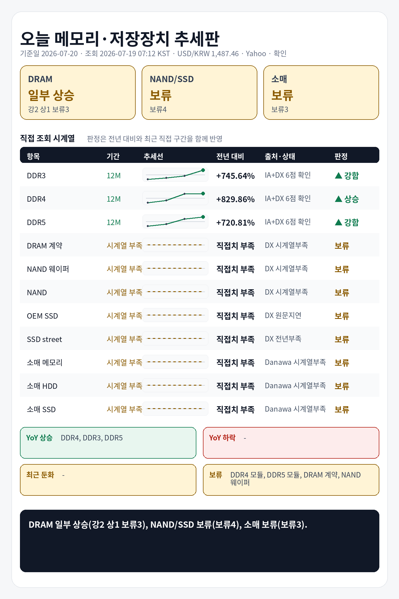

## 1. 기준 환율 1줄
USD/KRW: 1,487.46원 (조회 2026-07-19 07:12 KST, 출처 Yahoo Finance USDKRW=X, 원문 Last Update 2026-07-18 06:23 KST, 상태 확인, 전일 대비 -0.74%).

## 2. 오늘 한눈에 추세판
| 구분 | 현재값 | 전일 | 전주 | 전월 | 전년 | 추세 | 판정 |
|---|---:|---|---|---|---|---|---|
| DDR3 칩 | $13.175 (약 19,597원) | 공개 변화율 +0.00% | 확인 불가 | 확인 불가 | 전년 대비 +745.64% · 전년값 캡처 2025-07-17 18:54 KST, 원문 Last Update 별도 없음, 항목 DDR3 4Gb 512Mx8 1600/1866 · 출처 Internet Archive DRAMeXchange 공개표 캡처 | 전년 상승, 최근 직접구간 +118.20% | 강함 |
| DDR4 칩 | $80.200 (약 119,294원) | 공개 변화율 +0.09% | 확인 불가 | 확인 불가 | 전년 대비 +829.86% · 전년값 캡처 2025-07-17 18:54 KST, 원문 Last Update 별도 없음, 항목 DDR4 16Gb (2Gx8)3200 · 출처 Internet Archive DRAMeXchange 공개표 캡처 | 전년 상승, 최근 직접구간 +3.57% | 상승 |
| DDR5 칩 | $49.667 (약 73,878원) | 공개 변화율 +0.68% | 확인 불가 | 확인 불가 | 전년 대비 +720.81% · 전년값 캡처 2025-07-17 18:54 KST, 원문 Last Update 별도 없음, 항목 DDR5 16G (2Gx8) 4800/5600 · 출처 Internet Archive DRAMeXchange 공개표 캡처 | 전년 상승, 최근 직접구간 +25.21% | 강함 |
| DDR4 모듈 | $154.000 (약 229,069원) | 확인 불가 | 공개 변화율 +1.32% | 확인 불가 | 전년 직접치 부족 | 공개 변화율 +1.32% 기준 상승 | 판단 보류 |
| DDR5 모듈 | $209.000 (약 310,879원) | 확인 불가 | 공개 변화율 +0.00% | 확인 불가 | 전년 직접치 부족 | 공개 변화율 +0.00% 기준 보합 | 판단 보류 |
| DRAM 계약가 (DDR4 8GB SO-DIMM) | 지연/불일치 있음 | 확인 불가 | 확인 불가 | 지연/불일치 있음 | 현재 직접치 부족 | 지연/불일치 있음 | 판단 보류 |
| NAND 웨이퍼 | 확인 불가 | 확인 불가 | 확인 불가 | 확인 불가 | 현재 직접치 부족 | 확인 불가 | 판단 보류 |
| NAND 계약가 (NAND 128Gb 16Gx8 Speedns) | 지연/불일치 있음 | 확인 불가 | 확인 불가 | 지연/불일치 있음 | 현재 직접치 부족 | 지연/불일치 있음 | 판단 보류 |
| PC-client OEM SSD 계약가 (1TB-mSATA/M.2 TLC PCIe-Value Grade) | 지연/불일치 있음 | 확인 불가 | 확인 불가 | 지연/불일치 있음 | 현재 직접치 부족 | 지연/불일치 있음 | 판단 보류 |
| SSD street price (990 Pro) | $239.160 (약 355,741원) | 확인 불가 | 확인 불가 | 공개 변화율 +8.71%, 기준값 확인 불가 | 전년 직접치 부족 | 공개 변화율 +8.71% 기준 상승 | 판단 보류 |
| 소매 메모리 | 확인 불가: ConnectionError | 확인 불가 | 확인 불가 | 확인 불가 | 현재 직접치 부족 | 확인 불가: ConnectionError | 판단 보류 |
| 소매 HDD | 확인 불가: ConnectionError | 확인 불가 | 확인 불가 | 확인 불가 | 현재 직접치 부족 | 확인 불가: ConnectionError | 판단 보류 |
| 소매 SSD | 확인 불가: ConnectionError | 확인 불가 | 확인 불가 | 확인 불가 | 현재 직접치 부족 | 확인 불가: ConnectionError | 판단 보류 |

## 3. 상승·하락 요약 4줄
상승: DDR4 칩 상승(+829.86% YoY, 최근 +3.57%), DDR3 칩 강함(+745.64% YoY, 최근 +118.20%), DDR5 칩 강함(+720.81% YoY, 최근 +25.21%)
하락/둔화: 확인 불가
전년: DDR3 칩 +745.64%, DDR4 칩 +829.86%, DDR5 칩 +720.81%
보류: DDR4 모듈, DDR5 모듈, DRAM 계약가, NAND 웨이퍼, NAND 계약가, PC-client OEM SSD 계약가, SSD street price, 소매 메모리

## 4. 가격표
| 항목 | 현재값 | 조회 시각·출처·상태 | 원문 Last Update | 전월 대비 | 전년 대비 | 추세 |
|---|---:|---|---|---|---|---|
| DDR3 칩 | $13.175 (약 19,597원) | 2026-07-19 07:12 KST · DRAMeXchange 공개표 (https://www.dramexchange.com/Price/Dram_Spot) · 상태 확인 | 홈 공개표, 원문 Last Update 별도 없음, 항목 DDR3 4Gb 512Mx8 1600/1866 | 확인 불가 | 전년 대비 +745.64% · 전년값 캡처 2025-07-17 18:54 KST, 원문 Last Update 별도 없음, 항목 DDR3 4Gb 512Mx8 1600/1866 · 출처 Internet Archive DRAMeXchange 공개표 캡처 | 공개 변화율 +0.00% 기준 보합 |
| DDR4 칩 | $80.200 (약 119,294원) | 2026-07-19 07:12 KST · DRAMeXchange 공개표 (https://www.dramexchange.com/Price/Dram_Spot) · 상태 확인 | 홈 공개표, 원문 Last Update 별도 없음, 항목 DDR4 16Gb (2Gx8) 3200 | 확인 불가 | 전년 대비 +829.86% · 전년값 캡처 2025-07-17 18:54 KST, 원문 Last Update 별도 없음, 항목 DDR4 16Gb (2Gx8)3200 · 출처 Internet Archive DRAMeXchange 공개표 캡처 | 공개 변화율 +0.09% 기준 보합 |
| DDR5 칩 | $49.667 (약 73,878원) | 2026-07-19 07:12 KST · DRAMeXchange 공개표 (https://www.dramexchange.com/Price/Dram_Spot) · 상태 확인 | 홈 공개표, 원문 Last Update 별도 없음, 항목 DDR5 16Gb (2Gx8) 4800/5600 | 확인 불가 | 전년 대비 +720.81% · 전년값 캡처 2025-07-17 18:54 KST, 원문 Last Update 별도 없음, 항목 DDR5 16G (2Gx8) 4800/5600 · 출처 Internet Archive DRAMeXchange 공개표 캡처 | 공개 변화율 +0.68% 기준 상승 |
| DDR4 모듈 | $154.000 (약 229,069원) | 2026-07-19 07:12 KST · DRAMeXchange 공개표 (https://www.dramexchange.com/Price/Module_Spot) · 상태 확인 | 홈 공개표, 원문 Last Update 별도 없음, 항목 DDR4 UDIMM 16GB 3200 | 확인 불가 | 전년 직접치 부족 | 공개 변화율 +1.32% 기준 상승 |
| DDR5 모듈 | $209.000 (약 310,879원) | 2026-07-19 07:12 KST · DRAMeXchange 공개표 (https://www.dramexchange.com/Price/Module_Spot) · 상태 확인 | 홈 공개표, 원문 Last Update 별도 없음, 항목 DDR5 UDIMM 16GB 4800/5600 | 확인 불가 | 전년 직접치 부족 | 공개 변화율 +0.00% 기준 보합 |
| DRAM 계약가 (DDR4 8GB SO-DIMM) | 지연/불일치 있음 | 2026-07-19 07:12 KST · DRAMeXchange HomePrice NationalDramContract (https://www.dramexchange.com/Price/NationalContractDramDetail) · 상태 지연/불일치 있음 | 2026-05-29 15:00:00 | 지연/불일치 있음 | 현재 직접치 부족 | 지연/불일치 있음 |
| NAND 웨이퍼 | 확인 불가 | 2026-07-19 07:12 KST · DRAMeXchange 공개표 (https://www.dramexchange.com/) · 상태 확인 불가 | 확인 불가 | 확인 불가 | 현재 직접치 부족 | 확인 불가 |
| NAND 계약가 (NAND 128Gb 16Gx8 Speedns) | 지연/불일치 있음 | 2026-07-19 07:12 KST · DRAMeXchange HomePrice NationalFlashContract (https://www.dramexchange.com/Price/NationalContractFlashDetail) · 상태 지연/불일치 있음 | 2026-05-29 10:00:00 | 지연/불일치 있음 | 현재 직접치 부족 | 지연/불일치 있음 |
| PC-client OEM SSD 계약가 (1TB-mSATA/M.2 TLC PCIe-Value Grade) | 지연/불일치 있음 | 2026-07-19 07:12 KST · DRAMeXchange HomePrice PCC (https://www.dramexchange.com/Price/PCClientOEMSSD) · 상태 지연/불일치 있음 | 2026-04-27 10:00:00 | 지연/불일치 있음 | 현재 직접치 부족 | 지연/불일치 있음 |
| SSD street price (990 Pro) | $239.160 (약 355,741원) | 2026-07-19 07:12 KST · DRAMeXchange HomePrice SSD (https://www.dramexchange.com/Price/SSD_Street) · 상태 확인 | 2026-07-17 10:30:00 | 공개 변화율 +8.71%, 기준값 확인 불가 | 전년 직접치 부족 | 공개 변화율 +8.71% 기준 상승 |
| 소매 메모리 | 확인 불가: ConnectionError | 2026-07-19 07:12 KST · Danawa prod 가격비교 · 삼성전자 DDR5-5600 32GB (https://prod.danawa.com/info/?pcode=20644043) · 상태 확인 불가 | 확인 불가: ConnectionError | 확인 불가 | 현재 직접치 부족 | 확인 불가: ConnectionError |
| 소매 HDD | 확인 불가: ConnectionError | 2026-07-19 07:12 KST · Danawa prod 가격비교 · Seagate BarraCuda 8TB (https://prod.danawa.com/info/?pcode=5764992) · 상태 확인 불가 | 확인 불가: ConnectionError | 확인 불가 | 현재 직접치 부족 | 확인 불가: ConnectionError |
| 소매 SSD | 확인 불가: ConnectionError | 2026-07-19 07:12 KST · Danawa prod 가격비교 · Samsung 990 PRO 1TB (https://prod.danawa.com/info/?pcode=18297002) · 상태 확인 불가 | 확인 불가: ConnectionError | 확인 불가 | 현재 직접치 부족 | 확인 불가: ConnectionError |

## 5. 마지막 한 줄
전년 기준으로 가장 강한 쪽은 DDR4 칩, 가장 약한 쪽은 DDR5 칩, DRAM 전년+최근 판정은 일부 상승(강2 상1 보류3), NAND/SSD 전년+최근 판정은 보류(보류4), 소매 전년+최근 판정은 보류(보류3).

## 6. 마지막 이미지형 요약판

