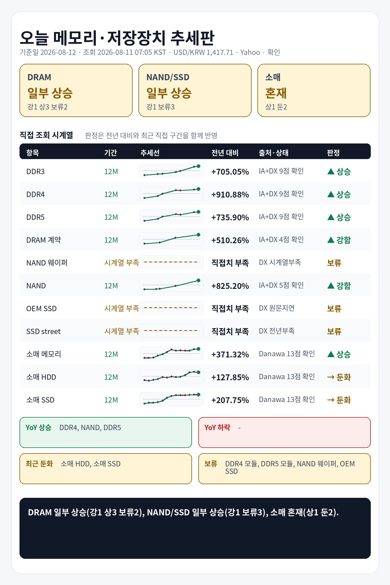

## 1. 기준 환율 1줄
USD/KRW: 1,417.71원 (조회 2026-08-11 07:05 KST, 출처 Yahoo Finance USDKRW=X, 원문 Last Update 2026-08-11 07:00 KST, 상태 확인, 전일 대비 -0.76%).

## 2. 오늘 한눈에 추세판
| 구분 | 현재값 | 전일 | 전주 | 전월 | 전년 | 추세 | 판정 |
|---|---:|---|---|---|---|---|---|
| DDR3 칩 | $14.024 (약 19,882원) | 공개 변화율 +0.34% | 확인 불가 | 확인 불가 | 전년 대비 +705.05% · 전년값 캡처 2025-08-11 06:04 KST, 원문 Last Update 별도 없음, 항목 DDR3 4Gb 512Mx8 1600/1866 · 출처 Internet Archive DRAMeXchange 공개표 캡처 | 전년 상승, 최근 직접구간 +6.44% | 상승 |
| DDR4 칩 | $86.744 (약 122,978원) | 공개 변화율 +0.55% | 확인 불가 | 확인 불가 | 전년 대비 +910.88% · 전년값 캡처 2025-08-11 06:04 KST, 원문 Last Update 별도 없음, 항목 DDR4 16Gb (2Gx8)3200 · 출처 Internet Archive DRAMeXchange 공개표 캡처 | 전년 상승, 최근 직접구간 +6.83% | 상승 |
| DDR5 칩 | $51.767 (약 73,391원) | 공개 변화율 +0.32% | 확인 불가 | 확인 불가 | 전년 대비 +735.90% · 전년값 캡처 2025-08-11 06:04 KST, 원문 Last Update 별도 없음, 항목 DDR5 16G (2Gx8) 4800/5600 · 출처 Internet Archive DRAMeXchange 공개표 캡처 | 전년 상승, 최근 직접구간 +3.40% | 상승 |
| DDR4 모듈 | $158.900 (약 225,274원) | 확인 불가 | 공개 변화율 +1.86% | 확인 불가 | 전년 직접치 부족 | 공개 변화율 +1.86% 기준 상승 | 판단 보류 |
| DDR5 모듈 | $222.500 (약 315,440원) | 확인 불가 | 공개 변화율 +3.49% | 확인 불가 | 전년 직접치 부족 | 공개 변화율 +3.49% 기준 상승 | 판단 보류 |
| DRAM 계약가 (DDR4 8GB SO-DIMM) | $119.000 (약 168,707원) | 확인 불가 | 확인 불가 | 공개 변화율 +0.00%, 기준값 확인 불가 | 전년 대비 +510.26% · 전년값 원문 2025-06-30 16:00:00, 캡처 2025-08-05 10:40 KST · 출처 Internet Archive DRAMeXchange HomePrice NationalDramContract 캡처 | 전년 상승, 최근 직접구간 +40.00% | 강함 |
| NAND 웨이퍼 | 확인 불가 | 확인 불가 | 확인 불가 | 확인 불가 | 현재 직접치 부족 | 확인 불가 | 판단 보류 |
| NAND 계약가 (NAND 128Gb 16Gx8 Speedns) | $28.820 (약 40,858원) | 확인 불가 | 확인 불가 | 공개 변화율 +8.72%, 기준값 확인 불가 | 전년 대비 +825.20% · 전년값 원문 2025-06-30 10:00:00, 캡처 2025-08-05 10:40 KST · 출처 Internet Archive DRAMeXchange HomePrice NationalFlashContract 캡처 | 전년 상승, 최근 직접구간 +127.56% | 강함 |
| PC-client OEM SSD 계약가 (1TB-mSATA/M.2 TLC PCIe-Value Grade) | 지연/불일치 있음 | 확인 불가 | 확인 불가 | 지연/불일치 있음 | 현재 직접치 부족 | 지연/불일치 있음 | 판단 보류 |
| SSD street price (990 Pro) | $238.880 (약 338,663원) | 확인 불가 | 확인 불가 | 공개 변화율 -0.12%, 기준값 확인 불가 | 전년 직접치 부족 | 공개 변화율 -0.12% 기준 보합 | 판단 보류 |
| 소매 메모리 (삼성전자 DDR5-5600 32GB) | 760,000원 | 확인 불가 | 확인 불가 | 확인 불가 | 전년 대비 +371.32% · 전년값 25-08 월간 가격추이 · 출처 Danawa 가격추이 24개월 · 삼성전자 DDR5-5600 32GB | 전년 상승, 최근 직접구간 +3.40% | 상승 |
| 소매 HDD (Seagate BarraCuda 8TB) | 464,070원 | 확인 불가 | 확인 불가 | 확인 불가 | 전년 대비 +127.85% · 전년값 25-08 월간 가격추이 · 출처 Danawa 가격추이 24개월 · Seagate BarraCuda 8TB | 전년 상승, 최근 직접구간 -3.22% | 둔화 |
| 소매 SSD (Samsung 990 PRO 1TB) | 397,000원 | 확인 불가 | 확인 불가 | 확인 불가 | 전년 대비 +207.75% · 전년값 25-08 월간 가격추이 · 출처 Danawa 가격추이 24개월 · Samsung 990 PRO 1TB | 전년 상승, 최근 직접구간 -0.75% | 둔화 |

## 3. 상승·하락 요약 4줄
상승: DDR4 칩 상승(+910.88% YoY, 최근 +6.83%), NAND 계약가 강함(+825.20% YoY, 최근 +127.56%), DDR5 칩 상승(+735.90% YoY, 최근 +3.40%), DDR3 칩 상승(+705.05% YoY, 최근 +6.44%), DRAM 계약가 강함(+510.26% YoY, 최근 +40.00%), 소매 메모리 상승(+371.32% YoY, 최근 +3.40%)
하락/둔화: 소매 SSD 둔화(+207.75% YoY, 최근 -0.75%), 소매 HDD 둔화(+127.85% YoY, 최근 -3.22%)
전년: DDR3 칩 +705.05%, DDR4 칩 +910.88%, DDR5 칩 +735.90%, DRAM 계약가 +510.26%, NAND 계약가 +825.20%, 소매 메모리 +371.32%
보류: DDR4 모듈, DDR5 모듈, NAND 웨이퍼, PC-client OEM SSD 계약가, SSD street price

## 4. 가격표
| 항목 | 현재값 | 조회 시각·출처·상태 | 원문 Last Update | 전월 대비 | 전년 대비 | 추세 |
|---|---:|---|---|---|---|---|
| DDR3 칩 | $14.024 (약 19,882원) | 2026-08-11 07:05 KST · DRAMeXchange 공개표 (https://www.dramexchange.com/Price/Dram_Spot) · 상태 확인 | 홈 공개표, 원문 Last Update 별도 없음, 항목 DDR3 4Gb 512Mx8 1600/1866 | 확인 불가 | 전년 대비 +705.05% · 전년값 캡처 2025-08-11 06:04 KST, 원문 Last Update 별도 없음, 항목 DDR3 4Gb 512Mx8 1600/1866 · 출처 Internet Archive DRAMeXchange 공개표 캡처 | 공개 변화율 +0.34% 기준 보합 |
| DDR4 칩 | $86.744 (약 122,978원) | 2026-08-11 07:05 KST · DRAMeXchange 공개표 (https://www.dramexchange.com/Price/Dram_Spot) · 상태 확인 | 홈 공개표, 원문 Last Update 별도 없음, 항목 DDR4 16Gb (2Gx8) 3200 | 확인 불가 | 전년 대비 +910.88% · 전년값 캡처 2025-08-11 06:04 KST, 원문 Last Update 별도 없음, 항목 DDR4 16Gb (2Gx8)3200 · 출처 Internet Archive DRAMeXchange 공개표 캡처 | 공개 변화율 +0.55% 기준 상승 |
| DDR5 칩 | $51.767 (약 73,391원) | 2026-08-11 07:05 KST · DRAMeXchange 공개표 (https://www.dramexchange.com/Price/Dram_Spot) · 상태 확인 | 홈 공개표, 원문 Last Update 별도 없음, 항목 DDR5 16Gb (2Gx8) 4800/5600 | 확인 불가 | 전년 대비 +735.90% · 전년값 캡처 2025-08-11 06:04 KST, 원문 Last Update 별도 없음, 항목 DDR5 16G (2Gx8) 4800/5600 · 출처 Internet Archive DRAMeXchange 공개표 캡처 | 공개 변화율 +0.32% 기준 보합 |
| DDR4 모듈 | $158.900 (약 225,274원) | 2026-08-11 07:05 KST · DRAMeXchange 공개표 (https://www.dramexchange.com/Price/Module_Spot) · 상태 확인 | 홈 공개표, 원문 Last Update 별도 없음, 항목 DDR4 UDIMM 16GB 3200 | 확인 불가 | 전년 직접치 부족 | 공개 변화율 +1.86% 기준 상승 |
| DDR5 모듈 | $222.500 (약 315,440원) | 2026-08-11 07:05 KST · DRAMeXchange 공개표 (https://www.dramexchange.com/Price/Module_Spot) · 상태 확인 | 홈 공개표, 원문 Last Update 별도 없음, 항목 DDR5 UDIMM 16GB 4800/5600 | 확인 불가 | 전년 직접치 부족 | 공개 변화율 +3.49% 기준 상승 |
| DRAM 계약가 (DDR4 8GB SO-DIMM) | $119.000 (약 168,707원) | 2026-08-11 07:05 KST · DRAMeXchange HomePrice NationalDramContract (https://www.dramexchange.com/Price/NationalContractDramDetail) · 상태 확인 | 2026-06-30 11:00:00 | 공개 변화율 +0.00%, 기준값 확인 불가 | 전년 대비 +510.26% · 전년값 원문 2025-06-30 16:00:00, 캡처 2025-08-05 10:40 KST · 출처 Internet Archive DRAMeXchange HomePrice NationalDramContract 캡처 | 공개 변화율 +0.00% 기준 보합 |
| NAND 웨이퍼 | 확인 불가 | 2026-08-11 07:05 KST · DRAMeXchange 공개표 (https://www.dramexchange.com/) · 상태 확인 불가 | 확인 불가 | 확인 불가 | 현재 직접치 부족 | 확인 불가 |
| NAND 계약가 (NAND 128Gb 16Gx8 Speedns) | $28.820 (약 40,858원) | 2026-08-11 07:05 KST · DRAMeXchange HomePrice NationalFlashContract (https://www.dramexchange.com/Price/NationalContractFlashDetail) · 상태 확인 | 2026-06-30 10:00:00 | 공개 변화율 +8.72%, 기준값 확인 불가 | 전년 대비 +825.20% · 전년값 원문 2025-06-30 10:00:00, 캡처 2025-08-05 10:40 KST · 출처 Internet Archive DRAMeXchange HomePrice NationalFlashContract 캡처 | 공개 변화율 +8.72% 기준 상승 |
| PC-client OEM SSD 계약가 (1TB-mSATA/M.2 TLC PCIe-Value Grade) | 지연/불일치 있음 | 2026-08-11 07:05 KST · DRAMeXchange HomePrice PCC (https://www.dramexchange.com/Price/PCClientOEMSSD) · 상태 지연/불일치 있음 | 2026-04-27 10:00:00 | 지연/불일치 있음 | 현재 직접치 부족 | 지연/불일치 있음 |
| SSD street price (990 Pro) | $238.880 (약 338,663원) | 2026-08-11 07:05 KST · DRAMeXchange HomePrice SSD (https://www.dramexchange.com/Price/SSD_Street) · 상태 확인 | 2026-07-31 10:30:00 | 공개 변화율 -0.12%, 기준값 확인 불가 | 전년 직접치 부족 | 공개 변화율 -0.12% 기준 보합 |
| 소매 메모리 (삼성전자 DDR5-5600 32GB) | 760,000원 | 2026-08-11 07:05 KST · Danawa prod 가격비교 · 삼성전자 DDR5-5600 32GB (https://prod.danawa.com/info/?pcode=20644043) · 상태 확인 | 상품 페이지 직접 조회, 원문 Last Update 별도 없음 | 확인 불가 | 전년 대비 +371.32% · 전년값 25-08 월간 가격추이 · 출처 Danawa 가격추이 24개월 · 삼성전자 DDR5-5600 32GB | 비교 기준값 확인 불가 |
| 소매 HDD (Seagate BarraCuda 8TB) | 464,070원 | 2026-08-11 07:05 KST · Danawa prod 가격비교 · Seagate BarraCuda 8TB (https://prod.danawa.com/info/?pcode=5764992) · 상태 확인 | 상품 페이지 직접 조회, 원문 Last Update 별도 없음 | 확인 불가 | 전년 대비 +127.85% · 전년값 25-08 월간 가격추이 · 출처 Danawa 가격추이 24개월 · Seagate BarraCuda 8TB | 비교 기준값 확인 불가 |
| 소매 SSD (Samsung 990 PRO 1TB) | 397,000원 | 2026-08-11 07:05 KST · Danawa prod 가격비교 · Samsung 990 PRO 1TB (https://prod.danawa.com/info/?pcode=18297002) · 상태 확인 | 상품 페이지 직접 조회, 원문 Last Update 별도 없음 | 확인 불가 | 전년 대비 +207.75% · 전년값 25-08 월간 가격추이 · 출처 Danawa 가격추이 24개월 · Samsung 990 PRO 1TB | 비교 기준값 확인 불가 |

## 5. 마지막 한 줄
전년 기준으로 가장 강한 쪽은 DDR4 칩, 가장 약한 쪽은 소매 HDD, DRAM 전년+최근 판정은 일부 상승(강1 상3 보류2), NAND/SSD 전년+최근 판정은 일부 상승(강1 보류3), 소매 전년+최근 판정은 혼재(상1 둔2).

## 6. 마지막 이미지형 요약판

