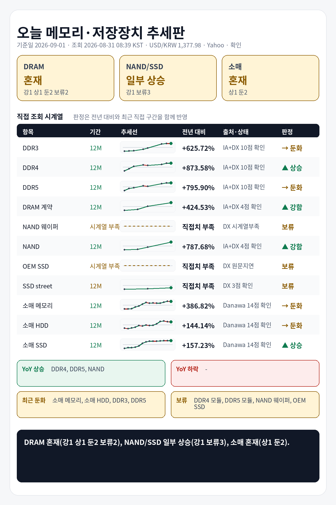

## 1. 기준 환율 1줄
USD/KRW: 1,377.98원 (조회 2026-08-31 08:39 KST, 출처 Yahoo Finance USDKRW=X, 원문 Last Update 2026-08-31 08:39 KST, 상태 확인, 전일 대비 -0.20%).

## 2. 오늘 한눈에 추세판
| 구분 | 현재값 | 전일 | 전주 | 전월 | 전년 | 추세 | 판정 |
|---|---:|---|---|---|---|---|---|
| DDR3 칩 | $13.883 (약 19,130원) | 공개 변화율 -0.35% | 확인 불가 | 확인 불가 | 전년 대비 +625.72% · 전년값 캡처 2025-09-02 01:36 KST, 원문 Last Update 별도 없음, 항목 DDR3 4Gb 512Mx8 1600/1866 · 출처 Internet Archive DRAMeXchange 공개표 캡처 | 전년 상승, 최근 직접구간 -0.49% | 둔화 |
| DDR4 칩 | $91.293 (약 125,800원) | 공개 변화율 +0.27% | 확인 불가 | 확인 불가 | 전년 대비 +873.58% · 전년값 캡처 2025-09-02 01:36 KST, 원문 Last Update 별도 없음, 항목 DDR4 16Gb (2Gx8)3200 · 출처 Internet Archive DRAMeXchange 공개표 캡처 | 전년 상승, 최근 직접구간 +0.78% | 상승 |
| DDR5 칩 | $53.933 (약 74,319원) | 공개 변화율 +0.00% | 확인 불가 | 확인 불가 | 전년 대비 +795.90% · 전년값 캡처 2025-09-02 01:36 KST, 원문 Last Update 별도 없음, 항목 DDR5 16G (2Gx8) 4800/5600 · 출처 Internet Archive DRAMeXchange 공개표 캡처 | 전년 상승, 최근 직접구간 +0.31% | 둔화 |
| DDR4 모듈 | $162.200 (약 223,508원) | 확인 불가 | 공개 변화율 +1.50% | 확인 불가 | 전년 직접치 부족 | 공개 변화율 +1.50% 기준 상승 | 판단 보류 |
| DDR5 모듈 | $227.500 (약 313,490원) | 확인 불가 | 공개 변화율 +1.11% | 확인 불가 | 전년 직접치 부족 | 공개 변화율 +1.11% 기준 상승 | 판단 보류 |
| DRAM 계약가 (DDR4 8GB SO-DIMM) | $139.000 (약 191,539원) | 확인 불가 | 확인 불가 | 공개 변화율 +16.81%, 기준값 확인 불가 | 전년 대비 +424.53% · 전년값 원문 2025-07-31 17:00:00, 캡처 2025-09-01 06:27 KST · 출처 Internet Archive DRAMeXchange HomePrice NationalDramContract 캡처 | 전년 상승, 최근 직접구간 +63.53% | 강함 |
| NAND 웨이퍼 | 확인 불가 | 확인 불가 | 확인 불가 | 확인 불가 | 현재 직접치 부족 | 확인 불가 | 판단 보류 |
| NAND 계약가 (NAND 128Gb 16Gx8 Speedns) | $30.048 (약 41,406원) | 확인 불가 | 확인 불가 | 공개 변화율 +4.26%, 기준값 확인 불가 | 전년 대비 +787.68% · 전년값 원문 2025-07-31 09:00:00, 캡처 2025-09-01 06:28 KST · 출처 Internet Archive DRAMeXchange HomePrice NationalFlashContract 캡처 | 전년 상승, 최근 직접구간 +137.25% | 강함 |
| PC-client OEM SSD 계약가 (1TB-mSATA/M.2 TLC PCIe-Value Grade) | 지연/불일치 있음 | 확인 불가 | 확인 불가 | 지연/불일치 있음 | 현재 직접치 부족 | 지연/불일치 있음 | 판단 보류 |
| SSD street price (990 Pro) | $239.990 (약 330,701원) | 확인 불가 | 확인 불가 | 공개 변화율 +0.23%, 기준값 확인 불가 | 전년 직접치 부족 | 공개 변화율 +0.23% 기준 보합 | 판단 보류 |
| 소매 메모리 (삼성전자 DDR5-5600 32GB) | 784,510원 | 확인 불가 | 확인 불가 | 확인 불가 | 전년 대비 +386.82% · 전년값 25-09 월간 가격추이 · 출처 Danawa 가격추이 24개월 · 삼성전자 DDR5-5600 32GB | 전년 상승, 최근 직접구간 -2.91% | 둔화 |
| 소매 HDD (Seagate BarraCuda 8TB) | 444,060원 | 확인 불가 | 확인 불가 | 확인 불가 | 전년 대비 +144.14% · 전년값 25-09 월간 가격추이 · 출처 Danawa 가격추이 24개월 · Seagate BarraCuda 8TB | 전년 상승, 최근 직접구간 -1.10% | 둔화 |
| 소매 SSD (Samsung 990 PRO 1TB) | 399,740원 | 확인 불가 | 확인 불가 | 확인 불가 | 전년 대비 +157.23% · 전년값 25-09 월간 가격추이 · 출처 Danawa 가격추이 24개월 · Samsung 990 PRO 1TB | 전년 상승, 최근 직접구간 +0.67% | 상승 |

## 3. 상승·하락 요약 4줄
상승: DDR4 칩 상승(+873.58% YoY, 최근 +0.78%), NAND 계약가 강함(+787.68% YoY, 최근 +137.25%), DRAM 계약가 강함(+424.53% YoY, 최근 +63.53%), 소매 SSD 상승(+157.23% YoY, 최근 +0.67%)
하락/둔화: DDR5 칩 둔화(+795.90% YoY, 최근 +0.31%), DDR3 칩 둔화(+625.72% YoY, 최근 -0.49%), 소매 메모리 둔화(+386.82% YoY, 최근 -2.91%), 소매 HDD 둔화(+144.14% YoY, 최근 -1.10%)
전년: DDR3 칩 +625.72%, DDR4 칩 +873.58%, DDR5 칩 +795.90%, DRAM 계약가 +424.53%, NAND 계약가 +787.68%, 소매 메모리 +386.82%
보류: DDR4 모듈, DDR5 모듈, NAND 웨이퍼, PC-client OEM SSD 계약가, SSD street price

## 4. 가격표
| 항목 | 현재값 | 조회 시각·출처·상태 | 원문 Last Update | 전월 대비 | 전년 대비 | 추세 |
|---|---:|---|---|---|---|---|
| DDR3 칩 | $13.883 (약 19,130원) | 2026-08-31 08:39 KST · DRAMeXchange 공개표 (https://www.dramexchange.com/Price/Dram_Spot) · 상태 확인 | 홈 공개표, 원문 Last Update 별도 없음, 항목 DDR3 4Gb 512Mx8 1600/1866 | 확인 불가 | 전년 대비 +625.72% · 전년값 캡처 2025-09-02 01:36 KST, 원문 Last Update 별도 없음, 항목 DDR3 4Gb 512Mx8 1600/1866 · 출처 Internet Archive DRAMeXchange 공개표 캡처 | 공개 변화율 -0.35% 기준 보합 |
| DDR4 칩 | $91.293 (약 125,800원) | 2026-08-31 08:39 KST · DRAMeXchange 공개표 (https://www.dramexchange.com/Price/Dram_Spot) · 상태 확인 | 홈 공개표, 원문 Last Update 별도 없음, 항목 DDR4 16Gb (2Gx8) 3200 | 확인 불가 | 전년 대비 +873.58% · 전년값 캡처 2025-09-02 01:36 KST, 원문 Last Update 별도 없음, 항목 DDR4 16Gb (2Gx8)3200 · 출처 Internet Archive DRAMeXchange 공개표 캡처 | 공개 변화율 +0.27% 기준 보합 |
| DDR5 칩 | $53.933 (약 74,319원) | 2026-08-31 08:39 KST · DRAMeXchange 공개표 (https://www.dramexchange.com/Price/Dram_Spot) · 상태 확인 | 홈 공개표, 원문 Last Update 별도 없음, 항목 DDR5 16Gb (2Gx8) 4800/5600 | 확인 불가 | 전년 대비 +795.90% · 전년값 캡처 2025-09-02 01:36 KST, 원문 Last Update 별도 없음, 항목 DDR5 16G (2Gx8) 4800/5600 · 출처 Internet Archive DRAMeXchange 공개표 캡처 | 공개 변화율 +0.00% 기준 보합 |
| DDR4 모듈 | $162.200 (약 223,508원) | 2026-08-31 08:39 KST · DRAMeXchange 공개표 (https://www.dramexchange.com/Price/Module_Spot) · 상태 확인 | 홈 공개표, 원문 Last Update 별도 없음, 항목 DDR4 UDIMM 16GB 3200 | 확인 불가 | 전년 직접치 부족 | 공개 변화율 +1.50% 기준 상승 |
| DDR5 모듈 | $227.500 (약 313,490원) | 2026-08-31 08:39 KST · DRAMeXchange 공개표 (https://www.dramexchange.com/Price/Module_Spot) · 상태 확인 | 홈 공개표, 원문 Last Update 별도 없음, 항목 DDR5 UDIMM 16GB 4800/5600 | 확인 불가 | 전년 직접치 부족 | 공개 변화율 +1.11% 기준 상승 |
| DRAM 계약가 (DDR4 8GB SO-DIMM) | $139.000 (약 191,539원) | 2026-08-31 08:39 KST · DRAMeXchange HomePrice NationalDramContract (https://www.dramexchange.com/Price/NationalContractDramDetail) · 상태 확인 | 2026-07-31 15:00:00 | 공개 변화율 +16.81%, 기준값 확인 불가 | 전년 대비 +424.53% · 전년값 원문 2025-07-31 17:00:00, 캡처 2025-09-01 06:27 KST · 출처 Internet Archive DRAMeXchange HomePrice NationalDramContract 캡처 | 공개 변화율 +16.81% 기준 상승 |
| NAND 웨이퍼 | 확인 불가 | 2026-08-31 08:39 KST · DRAMeXchange 공개표 (https://www.dramexchange.com/) · 상태 확인 불가 | 확인 불가 | 확인 불가 | 현재 직접치 부족 | 확인 불가 |
| NAND 계약가 (NAND 128Gb 16Gx8 Speedns) | $30.048 (약 41,406원) | 2026-08-31 08:39 KST · DRAMeXchange HomePrice NationalFlashContract (https://www.dramexchange.com/Price/NationalContractFlashDetail) · 상태 확인 | 2026-07-31 09:00:00 | 공개 변화율 +4.26%, 기준값 확인 불가 | 전년 대비 +787.68% · 전년값 원문 2025-07-31 09:00:00, 캡처 2025-09-01 06:28 KST · 출처 Internet Archive DRAMeXchange HomePrice NationalFlashContract 캡처 | 공개 변화율 +4.26% 기준 상승 |
| PC-client OEM SSD 계약가 (1TB-mSATA/M.2 TLC PCIe-Value Grade) | 지연/불일치 있음 | 2026-08-31 08:39 KST · DRAMeXchange HomePrice PCC (https://www.dramexchange.com/Price/PCClientOEMSSD) · 상태 지연/불일치 있음 | 2026-04-27 10:00:00 | 지연/불일치 있음 | 현재 직접치 부족 | 지연/불일치 있음 |
| SSD street price (990 Pro) | $239.990 (약 330,701원) | 2026-08-31 08:39 KST · DRAMeXchange HomePrice SSD (https://www.dramexchange.com/Price/SSD_Street) · 상태 확인 | 2026-08-28 10:30:00 | 공개 변화율 +0.23%, 기준값 확인 불가 | 전년 직접치 부족 | 공개 변화율 +0.23% 기준 보합 |
| 소매 메모리 (삼성전자 DDR5-5600 32GB) | 784,510원 | 2026-08-31 08:39 KST · Danawa prod 가격비교 · 삼성전자 DDR5-5600 32GB (https://prod.danawa.com/info/?pcode=20644043) · 상태 확인 | 상품 페이지 직접 조회, 원문 Last Update 별도 없음 | 확인 불가 | 전년 대비 +386.82% · 전년값 25-09 월간 가격추이 · 출처 Danawa 가격추이 24개월 · 삼성전자 DDR5-5600 32GB | 비교 기준값 확인 불가 |
| 소매 HDD (Seagate BarraCuda 8TB) | 444,060원 | 2026-08-31 08:39 KST · Danawa prod 가격비교 · Seagate BarraCuda 8TB (https://prod.danawa.com/info/?pcode=5764992) · 상태 확인 | 상품 페이지 직접 조회, 원문 Last Update 별도 없음 | 확인 불가 | 전년 대비 +144.14% · 전년값 25-09 월간 가격추이 · 출처 Danawa 가격추이 24개월 · Seagate BarraCuda 8TB | 비교 기준값 확인 불가 |
| 소매 SSD (Samsung 990 PRO 1TB) | 399,740원 | 2026-08-31 08:39 KST · Danawa prod 가격비교 · Samsung 990 PRO 1TB (https://prod.danawa.com/info/?pcode=18297002) · 상태 확인 | 상품 페이지 직접 조회, 원문 Last Update 별도 없음 | 확인 불가 | 전년 대비 +157.23% · 전년값 25-09 월간 가격추이 · 출처 Danawa 가격추이 24개월 · Samsung 990 PRO 1TB | 비교 기준값 확인 불가 |

## 5. 마지막 한 줄
전년 기준으로 가장 강한 쪽은 DDR4 칩, 가장 약한 쪽은 소매 HDD, DRAM 전년+최근 판정은 혼재(강1 상1 둔2 보류2), NAND/SSD 전년+최근 판정은 일부 상승(강1 보류3), 소매 전년+최근 판정은 혼재(상1 둔2).

## 6. 마지막 이미지형 요약판

