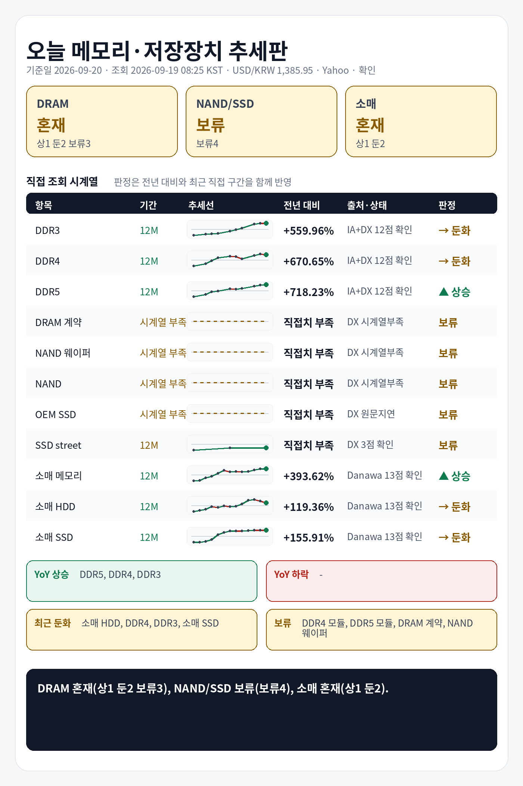

## 1. 기준 환율 1줄
USD/KRW: 1,385.95원 (조회 2026-09-19 08:25 KST, 출처 Yahoo Finance USDKRW=X, 원문 Last Update 2026-09-19 06:52 KST, 상태 확인, 전일 대비 +3.07%).

## 2. 오늘 한눈에 추세판
| 구분 | 현재값 | 전일 | 전주 | 전월 | 전년 | 추세 | 판정 |
|---|---:|---|---|---|---|---|---|
| DDR3 칩 | $13.780 (약 19,098원) | 공개 변화율 -0.08% | 확인 불가 | 확인 불가 | 전년 대비 +559.96% · 전년값 캡처 2025-09-20 17:16 KST, 원문 Last Update 별도 없음, 항목 DDR3 4Gb 512Mx8 1600/1866 · 출처 Internet Archive DRAMeXchange 공개표 캡처 | 전년 상승, 최근 직접구간 -0.74% | 둔화 |
| DDR4 칩 | $85.750 (약 118,845원) | 공개 변화율 -0.29% | 확인 불가 | 확인 불가 | 전년 대비 +670.65% · 전년값 캡처 2025-09-20 17:16 KST, 원문 Last Update 별도 없음, 항목 DDR4 16Gb (2Gx8)3200 · 출처 Internet Archive DRAMeXchange 공개표 캡처 | 전년 상승, 최근 직접구간 -6.07% | 둔화 |
| DDR5 칩 | $56.000 (약 77,613원) | 공개 변화율 +1.39% | 확인 불가 | 확인 불가 | 전년 대비 +718.23% · 전년값 캡처 2025-09-20 17:16 KST, 원문 Last Update 별도 없음, 항목 DDR5 16G (2Gx8) 4800/5600 · 출처 Internet Archive DRAMeXchange 공개표 캡처 | 전년 상승, 최근 직접구간 +3.83% | 상승 |
| DDR4 모듈 | $163.700 (약 226,880원) | 확인 불가 | 공개 변화율 +0.00% | 확인 불가 | 전년 직접치 부족 | 공개 변화율 +0.00% 기준 보합 | 판단 보류 |
| DDR5 모듈 | $234.000 (약 324,312원) | 확인 불가 | 공개 변화율 +1.74% | 확인 불가 | 전년 직접치 부족 | 공개 변화율 +1.74% 기준 상승 | 판단 보류 |
| DRAM 계약가 (DDR4 8GB SO-DIMM) | 지연/불일치 있음 | 확인 불가 | 확인 불가 | 지연/불일치 있음 | 현재 직접치 부족 | 지연/불일치 있음 | 판단 보류 |
| NAND 웨이퍼 | 확인 불가 | 확인 불가 | 확인 불가 | 확인 불가 | 현재 직접치 부족 | 확인 불가 | 판단 보류 |
| NAND 계약가 (NAND 128Gb 16Gx8 Speedns) | 지연/불일치 있음 | 확인 불가 | 확인 불가 | 지연/불일치 있음 | 현재 직접치 부족 | 지연/불일치 있음 | 판단 보류 |
| PC-client OEM SSD 계약가 (1TB-mSATA/M.2 TLC PCIe-Value Grade) | 지연/불일치 있음 | 확인 불가 | 확인 불가 | 지연/불일치 있음 | 현재 직접치 부족 | 지연/불일치 있음 | 판단 보류 |
| SSD street price (990 Pro) | $239.990 (약 332,614원) | 확인 불가 | 확인 불가 | 공개 변화율 +0.00%, 기준값 확인 불가 | 전년 직접치 부족 | 공개 변화율 +0.00% 기준 보합 | 판단 보류 |
| 소매 메모리 (삼성전자 DDR5-5600 32GB) | 795,470원 | 확인 불가 | 확인 불가 | 확인 불가 | 전년 대비 +393.62% · 전년값 25-09 월간 가격추이 · 출처 Danawa 가격추이 24개월 · 삼성전자 DDR5-5600 32GB | 전년 상승, 최근 직접구간 +0.82% | 상승 |
| 소매 HDD (Seagate BarraCuda 8TB) | 399,000원 | 확인 불가 | 확인 불가 | 확인 불가 | 전년 대비 +119.36% · 전년값 25-09 월간 가격추이 · 출처 Danawa 가격추이 24개월 · Seagate BarraCuda 8TB | 전년 상승, 최근 직접구간 -10.15% | 둔화 |
| 소매 SSD (Samsung 990 PRO 1TB) | 397,690원 | 확인 불가 | 확인 불가 | 확인 불가 | 전년 대비 +155.91% · 전년값 25-09 월간 가격추이 · 출처 Danawa 가격추이 24개월 · Samsung 990 PRO 1TB | 전년 상승, 최근 직접구간 -0.51% | 둔화 |

## 3. 상승·하락 요약 4줄
상승: DDR5 칩 상승(+718.23% YoY, 최근 +3.83%), 소매 메모리 상승(+393.62% YoY, 최근 +0.82%)
하락/둔화: DDR4 칩 둔화(+670.65% YoY, 최근 -6.07%), DDR3 칩 둔화(+559.96% YoY, 최근 -0.74%), 소매 SSD 둔화(+155.91% YoY, 최근 -0.51%), 소매 HDD 둔화(+119.36% YoY, 최근 -10.15%)
전년: DDR3 칩 +559.96%, DDR4 칩 +670.65%, DDR5 칩 +718.23%, 소매 메모리 +393.62%, 소매 HDD +119.36%, 소매 SSD +155.91%
보류: DDR4 모듈, DDR5 모듈, DRAM 계약가, NAND 웨이퍼, NAND 계약가, PC-client OEM SSD 계약가, SSD street price

## 4. 가격표
| 항목 | 현재값 | 조회 시각·출처·상태 | 원문 Last Update | 전월 대비 | 전년 대비 | 추세 |
|---|---:|---|---|---|---|---|
| DDR3 칩 | $13.780 (약 19,098원) | 2026-09-19 08:25 KST · DRAMeXchange 공개표 (https://www.dramexchange.com/Price/Dram_Spot) · 상태 확인 | 홈 공개표, 원문 Last Update 별도 없음, 항목 DDR3 4Gb 512Mx8 1600/1866 | 확인 불가 | 전년 대비 +559.96% · 전년값 캡처 2025-09-20 17:16 KST, 원문 Last Update 별도 없음, 항목 DDR3 4Gb 512Mx8 1600/1866 · 출처 Internet Archive DRAMeXchange 공개표 캡처 | 공개 변화율 -0.08% 기준 보합 |
| DDR4 칩 | $85.750 (약 118,845원) | 2026-09-19 08:25 KST · DRAMeXchange 공개표 (https://www.dramexchange.com/Price/Dram_Spot) · 상태 확인 | 홈 공개표, 원문 Last Update 별도 없음, 항목 DDR4 16Gb (2Gx8) 3200 | 확인 불가 | 전년 대비 +670.65% · 전년값 캡처 2025-09-20 17:16 KST, 원문 Last Update 별도 없음, 항목 DDR4 16Gb (2Gx8)3200 · 출처 Internet Archive DRAMeXchange 공개표 캡처 | 공개 변화율 -0.29% 기준 보합 |
| DDR5 칩 | $56.000 (약 77,613원) | 2026-09-19 08:25 KST · DRAMeXchange 공개표 (https://www.dramexchange.com/Price/Dram_Spot) · 상태 확인 | 홈 공개표, 원문 Last Update 별도 없음, 항목 DDR5 16Gb (2Gx8) 4800/5600 | 확인 불가 | 전년 대비 +718.23% · 전년값 캡처 2025-09-20 17:16 KST, 원문 Last Update 별도 없음, 항목 DDR5 16G (2Gx8) 4800/5600 · 출처 Internet Archive DRAMeXchange 공개표 캡처 | 공개 변화율 +1.39% 기준 상승 |
| DDR4 모듈 | $163.700 (약 226,880원) | 2026-09-19 08:25 KST · DRAMeXchange 공개표 (https://www.dramexchange.com/Price/Module_Spot) · 상태 확인 | 홈 공개표, 원문 Last Update 별도 없음, 항목 DDR4 UDIMM 16GB 3200 | 확인 불가 | 전년 직접치 부족 | 공개 변화율 +0.00% 기준 보합 |
| DDR5 모듈 | $234.000 (약 324,312원) | 2026-09-19 08:25 KST · DRAMeXchange 공개표 (https://www.dramexchange.com/Price/Module_Spot) · 상태 확인 | 홈 공개표, 원문 Last Update 별도 없음, 항목 DDR5 UDIMM 16GB 4800/5600 | 확인 불가 | 전년 직접치 부족 | 공개 변화율 +1.74% 기준 상승 |
| DRAM 계약가 (DDR4 8GB SO-DIMM) | 지연/불일치 있음 | 2026-09-19 08:25 KST · DRAMeXchange HomePrice NationalDramContract (https://www.dramexchange.com/Price/NationalContractDramDetail) · 상태 지연/불일치 있음 | 2026-07-31 15:00:00 | 지연/불일치 있음 | 현재 직접치 부족 | 지연/불일치 있음 |
| NAND 웨이퍼 | 확인 불가 | 2026-09-19 08:25 KST · DRAMeXchange 공개표 (https://www.dramexchange.com/) · 상태 확인 불가 | 확인 불가 | 확인 불가 | 현재 직접치 부족 | 확인 불가 |
| NAND 계약가 (NAND 128Gb 16Gx8 Speedns) | 지연/불일치 있음 | 2026-09-19 08:25 KST · DRAMeXchange HomePrice NationalFlashContract (https://www.dramexchange.com/Price/NationalContractFlashDetail) · 상태 지연/불일치 있음 | 2026-07-31 09:00:00 | 지연/불일치 있음 | 현재 직접치 부족 | 지연/불일치 있음 |
| PC-client OEM SSD 계약가 (1TB-mSATA/M.2 TLC PCIe-Value Grade) | 지연/불일치 있음 | 2026-09-19 08:25 KST · DRAMeXchange HomePrice PCC (https://www.dramexchange.com/Price/PCClientOEMSSD) · 상태 지연/불일치 있음 | 2026-04-27 10:00:00 | 지연/불일치 있음 | 현재 직접치 부족 | 지연/불일치 있음 |
| SSD street price (990 Pro) | $239.990 (약 332,614원) | 2026-09-19 08:25 KST · DRAMeXchange HomePrice SSD (https://www.dramexchange.com/Price/SSD_Street) · 상태 확인 | 2026-09-11 13:00:00 | 공개 변화율 +0.00%, 기준값 확인 불가 | 전년 직접치 부족 | 공개 변화율 +0.00% 기준 보합 |
| 소매 메모리 (삼성전자 DDR5-5600 32GB) | 795,470원 | 2026-09-19 08:25 KST · Danawa prod 가격비교 · 삼성전자 DDR5-5600 32GB (https://prod.danawa.com/info/?pcode=20644043) · 상태 확인 | 상품 페이지 직접 조회, 원문 Last Update 별도 없음 | 확인 불가 | 전년 대비 +393.62% · 전년값 25-09 월간 가격추이 · 출처 Danawa 가격추이 24개월 · 삼성전자 DDR5-5600 32GB | 비교 기준값 확인 불가 |
| 소매 HDD (Seagate BarraCuda 8TB) | 399,000원 | 2026-09-19 08:25 KST · Danawa prod 가격비교 · Seagate BarraCuda 8TB (https://prod.danawa.com/info/?pcode=5764992) · 상태 확인 | 상품 페이지 직접 조회, 원문 Last Update 별도 없음 | 확인 불가 | 전년 대비 +119.36% · 전년값 25-09 월간 가격추이 · 출처 Danawa 가격추이 24개월 · Seagate BarraCuda 8TB | 비교 기준값 확인 불가 |
| 소매 SSD (Samsung 990 PRO 1TB) | 397,690원 | 2026-09-19 08:25 KST · Danawa prod 가격비교 · Samsung 990 PRO 1TB (https://prod.danawa.com/info/?pcode=18297002) · 상태 확인 | 상품 페이지 직접 조회, 원문 Last Update 별도 없음 | 확인 불가 | 전년 대비 +155.91% · 전년값 25-09 월간 가격추이 · 출처 Danawa 가격추이 24개월 · Samsung 990 PRO 1TB | 비교 기준값 확인 불가 |

## 5. 마지막 한 줄
전년 기준으로 가장 강한 쪽은 DDR5 칩, 가장 약한 쪽은 소매 HDD, DRAM 전년+최근 판정은 혼재(상1 둔2 보류3), NAND/SSD 전년+최근 판정은 보류(보류4), 소매 전년+최근 판정은 혼재(상1 둔2).

## 6. 마지막 이미지형 요약판

