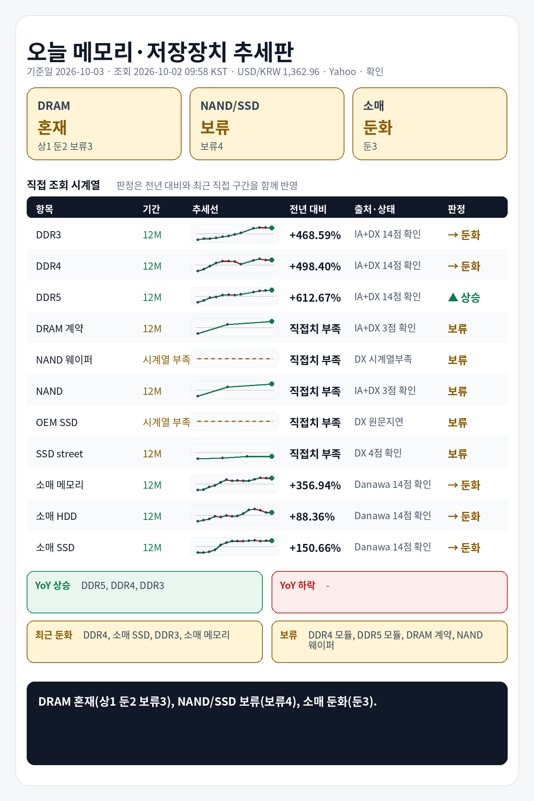

## 1. 기준 환율 1줄
USD/KRW: 1,362.96원 (조회 2026-10-02 09:58 KST, 출처 Yahoo Finance USDKRW=X, 원문 Last Update 2026-10-02 09:58 KST, 상태 확인, 전일 대비 +0.62%).

## 2. 오늘 한눈에 추세판
| 구분 | 현재값 | 전일 | 전주 | 전월 | 전년 | 추세 | 판정 |
|---|---:|---|---|---|---|---|---|
| DDR3 칩 | $13.720 (약 18,700원) | 공개 변화율 +0.00% | 확인 불가 | 확인 불가 | 전년 대비 +468.59% · 전년값 캡처 2025-10-06 15:17 KST, 원문 Last Update 별도 없음, 항목 DDR3 4Gb 512Mx8 1600/1866 · 출처 Internet Archive DRAMeXchange 공개표 캡처 | 전년 상승, 최근 직접구간 -0.44% | 둔화 |
| DDR4 칩 | $83.662 (약 114,028원) | 공개 변화율 -0.03% | 확인 불가 | 확인 불가 | 전년 대비 +498.40% · 전년값 캡처 2025-10-06 15:17 KST, 원문 Last Update 별도 없음, 항목 DDR4 16Gb (2Gx8)3200 · 출처 Internet Archive DRAMeXchange 공개표 캡처 | 전년 상승, 최근 직접구간 -1.57% | 둔화 |
| DDR5 칩 | $57.933 (약 78,960원) | 공개 변화율 +0.06% | 확인 불가 | 확인 불가 | 전년 대비 +612.67% · 전년값 캡처 2025-10-06 15:17 KST, 원문 Last Update 별도 없음, 항목 DDR5 16G (2Gx8) 4800/5600 · 출처 Internet Archive DRAMeXchange 공개표 캡처 | 전년 상승, 최근 직접구간 +1.76% | 상승 |
| DDR4 모듈 | $166.000 (약 226,251원) | 확인 불가 | 공개 변화율 +0.55% | 확인 불가 | 전년 직접치 부족 | 공개 변화율 +0.55% 기준 상승 | 판단 보류 |
| DDR5 모듈 | $239.000 (약 325,747원) | 확인 불가 | 공개 변화율 +0.00% | 확인 불가 | 전년 직접치 부족 | 공개 변화율 +0.00% 기준 보합 | 판단 보류 |
| DRAM 계약가 (DDR4 8GB SO-DIMM) | $142.000 (약 193,540원) | 확인 불가 | 확인 불가 | 공개 변화율 +2.16%, 기준값 확인 불가 | 전년 직접치 부족 | 공개 변화율 +2.16% 기준 상승 | 판단 보류 |
| NAND 웨이퍼 | 확인 불가 | 확인 불가 | 확인 불가 | 확인 불가 | 현재 직접치 부족 | 확인 불가 | 판단 보류 |
| NAND 계약가 (NAND 128Gb 16Gx8 Speedns) | $30.475 (약 41,536원) | 확인 불가 | 확인 불가 | 공개 변화율 +1.42%, 기준값 확인 불가 | 전년 직접치 부족 | 공개 변화율 +1.42% 기준 상승 | 판단 보류 |
| PC-client OEM SSD 계약가 (1TB-mSATA/M.2 TLC PCIe-Value Grade) | 지연/불일치 있음 | 확인 불가 | 확인 불가 | 지연/불일치 있음 | 현재 직접치 부족 | 지연/불일치 있음 | 판단 보류 |
| SSD street price (990 Pro) | $239.990 (약 327,097원) | 확인 불가 | 확인 불가 | 공개 변화율 +0.00%, 기준값 확인 불가 | 전년 직접치 부족 | 공개 변화율 +0.00% 기준 보합 | 판단 보류 |
| 소매 메모리 (삼성전자 DDR5-5600 32GB) | 790,960원 | 확인 불가 | 확인 불가 | 확인 불가 | 전년 대비 +356.94% · 전년값 25-10 월간 가격추이 · 출처 Danawa 가격추이 24개월 · 삼성전자 DDR5-5600 32GB | 전년 상승, 최근 직접구간 -0.37% | 둔화 |
| 소매 HDD (Seagate BarraCuda 8TB) | 399,000원 | 확인 불가 | 확인 불가 | 확인 불가 | 전년 대비 +88.36% · 전년값 25-10 월간 가격추이 · 출처 Danawa 가격추이 24개월 · Seagate BarraCuda 8TB | 전년 상승, 최근 직접구간 +0.00% | 둔화 |
| 소매 SSD (Samsung 990 PRO 1TB) | 393,930원 | 확인 불가 | 확인 불가 | 확인 불가 | 전년 대비 +150.66% · 전년값 25-10 월간 가격추이 · 출처 Danawa 가격추이 24개월 · Samsung 990 PRO 1TB | 전년 상승, 최근 직접구간 -0.50% | 둔화 |

## 3. 상승·하락 요약 4줄
상승: DDR5 칩 상승(+612.67% YoY, 최근 +1.76%)
하락/둔화: DDR4 칩 둔화(+498.40% YoY, 최근 -1.57%), DDR3 칩 둔화(+468.59% YoY, 최근 -0.44%), 소매 메모리 둔화(+356.94% YoY, 최근 -0.37%), 소매 SSD 둔화(+150.66% YoY, 최근 -0.50%), 소매 HDD 둔화(+88.36% YoY, 최근 +0.00%)
전년: DDR3 칩 +468.59%, DDR4 칩 +498.40%, DDR5 칩 +612.67%, 소매 메모리 +356.94%, 소매 HDD +88.36%, 소매 SSD +150.66%
보류: DDR4 모듈, DDR5 모듈, DRAM 계약가, NAND 웨이퍼, NAND 계약가, PC-client OEM SSD 계약가, SSD street price

## 4. 가격표
| 항목 | 현재값 | 조회 시각·출처·상태 | 원문 Last Update | 전월 대비 | 전년 대비 | 추세 |
|---|---:|---|---|---|---|---|
| DDR3 칩 | $13.720 (약 18,700원) | 2026-10-02 09:58 KST · DRAMeXchange 공개표 (https://www.dramexchange.com/Price/Dram_Spot) · 상태 확인 | 홈 공개표, 원문 Last Update 별도 없음, 항목 DDR3 4Gb 512Mx8 1600/1866 | 확인 불가 | 전년 대비 +468.59% · 전년값 캡처 2025-10-06 15:17 KST, 원문 Last Update 별도 없음, 항목 DDR3 4Gb 512Mx8 1600/1866 · 출처 Internet Archive DRAMeXchange 공개표 캡처 | 공개 변화율 +0.00% 기준 보합 |
| DDR4 칩 | $83.662 (약 114,028원) | 2026-10-02 09:58 KST · DRAMeXchange 공개표 (https://www.dramexchange.com/Price/Dram_Spot) · 상태 확인 | 홈 공개표, 원문 Last Update 별도 없음, 항목 DDR4 16Gb (2Gx8) 3200 | 확인 불가 | 전년 대비 +498.40% · 전년값 캡처 2025-10-06 15:17 KST, 원문 Last Update 별도 없음, 항목 DDR4 16Gb (2Gx8)3200 · 출처 Internet Archive DRAMeXchange 공개표 캡처 | 공개 변화율 -0.03% 기준 보합 |
| DDR5 칩 | $57.933 (약 78,960원) | 2026-10-02 09:58 KST · DRAMeXchange 공개표 (https://www.dramexchange.com/Price/Dram_Spot) · 상태 확인 | 홈 공개표, 원문 Last Update 별도 없음, 항목 DDR5 16Gb (2Gx8) 4800/5600 | 확인 불가 | 전년 대비 +612.67% · 전년값 캡처 2025-10-06 15:17 KST, 원문 Last Update 별도 없음, 항목 DDR5 16G (2Gx8) 4800/5600 · 출처 Internet Archive DRAMeXchange 공개표 캡처 | 공개 변화율 +0.06% 기준 보합 |
| DDR4 모듈 | $166.000 (약 226,251원) | 2026-10-02 09:58 KST · DRAMeXchange 공개표 (https://www.dramexchange.com/Price/Module_Spot) · 상태 확인 | 홈 공개표, 원문 Last Update 별도 없음, 항목 DDR4 UDIMM 16GB 3200 | 확인 불가 | 전년 직접치 부족 | 공개 변화율 +0.55% 기준 상승 |
| DDR5 모듈 | $239.000 (약 325,747원) | 2026-10-02 09:58 KST · DRAMeXchange 공개표 (https://www.dramexchange.com/Price/Module_Spot) · 상태 확인 | 홈 공개표, 원문 Last Update 별도 없음, 항목 DDR5 UDIMM 16GB 4800/5600 | 확인 불가 | 전년 직접치 부족 | 공개 변화율 +0.00% 기준 보합 |
| DRAM 계약가 (DDR4 8GB SO-DIMM) | $142.000 (약 193,540원) | 2026-10-02 09:58 KST · DRAMeXchange HomePrice NationalDramContract (https://www.dramexchange.com/Price/NationalContractDramDetail) · 상태 확인 | 2026-08-31 14:00:00 | 공개 변화율 +2.16%, 기준값 확인 불가 | 전년 직접치 부족 | 공개 변화율 +2.16% 기준 상승 |
| NAND 웨이퍼 | 확인 불가 | 2026-10-02 09:58 KST · DRAMeXchange 공개표 (https://www.dramexchange.com/) · 상태 확인 불가 | 확인 불가 | 확인 불가 | 현재 직접치 부족 | 확인 불가 |
| NAND 계약가 (NAND 128Gb 16Gx8 Speedns) | $30.475 (약 41,536원) | 2026-10-02 09:58 KST · DRAMeXchange HomePrice NationalFlashContract (https://www.dramexchange.com/Price/NationalContractFlashDetail) · 상태 확인 | 2026-08-31 18:00:00 | 공개 변화율 +1.42%, 기준값 확인 불가 | 전년 직접치 부족 | 공개 변화율 +1.42% 기준 상승 |
| PC-client OEM SSD 계약가 (1TB-mSATA/M.2 TLC PCIe-Value Grade) | 지연/불일치 있음 | 2026-10-02 09:58 KST · DRAMeXchange HomePrice PCC (https://www.dramexchange.com/Price/PCClientOEMSSD) · 상태 지연/불일치 있음 | 2026-08-05 11:00:00 | 지연/불일치 있음 | 현재 직접치 부족 | 지연/불일치 있음 |
| SSD street price (990 Pro) | $239.990 (약 327,097원) | 2026-10-02 09:58 KST · DRAMeXchange HomePrice SSD (https://www.dramexchange.com/Price/SSD_Street) · 상태 확인 | 2026-09-24 11:30:00 | 공개 변화율 +0.00%, 기준값 확인 불가 | 전년 직접치 부족 | 공개 변화율 +0.00% 기준 보합 |
| 소매 메모리 (삼성전자 DDR5-5600 32GB) | 790,960원 | 2026-10-02 09:58 KST · Danawa prod 가격비교 · 삼성전자 DDR5-5600 32GB (https://prod.danawa.com/info/?pcode=20644043) · 상태 확인 | 상품 페이지 직접 조회, 원문 Last Update 별도 없음 | 확인 불가 | 전년 대비 +356.94% · 전년값 25-10 월간 가격추이 · 출처 Danawa 가격추이 24개월 · 삼성전자 DDR5-5600 32GB | 비교 기준값 확인 불가 |
| 소매 HDD (Seagate BarraCuda 8TB) | 399,000원 | 2026-10-02 09:58 KST · Danawa prod 가격비교 · Seagate BarraCuda 8TB (https://prod.danawa.com/info/?pcode=5764992) · 상태 확인 | 상품 페이지 직접 조회, 원문 Last Update 별도 없음 | 확인 불가 | 전년 대비 +88.36% · 전년값 25-10 월간 가격추이 · 출처 Danawa 가격추이 24개월 · Seagate BarraCuda 8TB | 비교 기준값 확인 불가 |
| 소매 SSD (Samsung 990 PRO 1TB) | 393,930원 | 2026-10-02 09:58 KST · Danawa prod 가격비교 · Samsung 990 PRO 1TB (https://prod.danawa.com/info/?pcode=18297002) · 상태 확인 | 상품 페이지 직접 조회, 원문 Last Update 별도 없음 | 확인 불가 | 전년 대비 +150.66% · 전년값 25-10 월간 가격추이 · 출처 Danawa 가격추이 24개월 · Samsung 990 PRO 1TB | 비교 기준값 확인 불가 |

## 5. 마지막 한 줄
전년 기준으로 가장 강한 쪽은 DDR5 칩, 가장 약한 쪽은 소매 HDD, DRAM 전년+최근 판정은 혼재(상1 둔2 보류3), NAND/SSD 전년+최근 판정은 보류(보류4), 소매 전년+최근 판정은 둔화(둔3).

## 6. 마지막 이미지형 요약판

